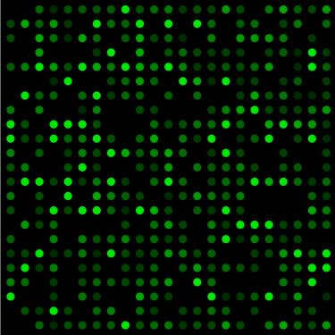

## Introduction  
In this workshop we will start by analysing a microarray dataset available on the [NCBI GEO](https://www.ncbi.nlm.nih.gov/geo/) repository.  
The data were first published in a [PNAS paper by Jin et al. (2011)](https://doi.org/10.1073/pnas.1017214108).  
The dataset is identified by a ***data series*** (GSE) ID: GSE26868. The web page for this data series is [here](https://www.ncbi.nlm.nih.gov/geo/query/acc.cgi?acc=GSE26868).  
The page contains quite a bit of information about the data, including e.g. the authors, a summary, and a link to the PNAS paper where the data were first described.  
The page further provides access to the microarray data in different formats:  

* the raw (image) data: *GSE26868_RAW.tar*  
* processed data: normalised and log-transformed expression data: *"Series Matrix File"*  
* plus other data formats  


## Overview  

In this first script we will take a first look at the processed data matrix.  

1. Download data from the NCBI GEO web server.  
2. Open the downloaded file, which contains both expression data and meta data.  
3. Explore the meta data to learn about the experimental conditions and numers of replicates.  
4. Begin exploring the actual expression data with a boxplot and a multidimensional scaling (MDS) plot.  


## Script setup  
In the first code chunks of this script we will:  

* Clear memory and console  
* Check that all necessary packages are installed  
* Load a few packages  

```{r Clear-memory}
rm(list=ls(all=T)) # Clear memory
cat("\014") # Clear console
options(stringsAsFactors = FALSE)
```

```{r Load-packages, warning=FALSE, message=FALSE}
source("source/packages.R")
```


## Download data    
The following code will download a "series matrix" from the [NCBI GEO](https://www.ncbi.nlm.nih.gov/geo/) site and save it in a local file. GEO series matrix files contain gene expression values that have already been background-corrected and normalised. The matrix files also contain a lot of 'meta data' that describe the samples, protocols used, much information about the genes covered etc.  

```{r download-matrix-file, message=FALSE}
# Define file name:
dest.file <- "GSE26868_series_matrix.txt.gz"

# Download data only if the local file doesn't already exist:
if (!file.exists(dest.file)) {
  download.file(url=paste0(
    "ftp://ftp.ncbi.nlm.nih.gov/geo/series/GSE26nnn",
    "/GSE26868/matrix/GSE26868_series_matrix.txt.gz"
  ),
  destfile = dest.file)
}
```


```{r File-name, results="asis"}
cat("Local data file:<b>", dest.file, "</b>")
```

## Load the data  
Now that the GEO file has been downloaded, we open it using the `GEOquery::getGEO()` function.

```{r Open-file, results="hide"}
gse <- GEOquery::getGEO(filename = dest.file, GSEMatrix=TRUE)
```

### 'ExpressionSet'  
What `class` of data has been generated?  
```{r Data-class}
class(gse)
```

As you can see, the `GEOquery::getGEO()` has saved the data from the matrix file in a so-called **"ExpressionSet"**. An ExpressionSet is a special data structure used to store microarray data - it contains both the actual gene expression expression data as well as the meta data. Functions from the `Biobase` package can be used to extract specific information from an ExpressionSet as we will see below.


:::{.exercise}
{height=30px}
**EXERCISE 1**  

What is the size of the `gse` ExpressionSet data object (in Mb)?
:::

```{r Exercise1}
# Use this chunk for exercise code
```


### What experimental conditions were used?  
In GEO each sample also gets a unique ID that always starts with 'GSM' (*='GEO sample'*).  

We can use `Biobase::sampleNames()` to obtain just the sample IDs:  
```{r Sample-names}
Biobase::sampleNames(gse) %>% sort %>% cat(., sep="\n")
```


We use the `Biobase::pData()` function to obtain detailed information about the samples. The code below extracts just two fields from the meta data ('title' and 'source_name_ch1'):  
```{r Sample-data}
# knitr::kable() and
# kableExtra::kable_styling() print the table
Biobase::pData(gse) %>% 
  dplyr::select(title, source_name_ch1) %>%
  knitr::kable(.) %>% 
  kableExtra::kable_styling(bootstrap_options = c("striped"))
```

**Conclusions:**  
The table above shows us that the samples were from **two cell lines**:

* HeLa cells (human cervical carcinoma cell line)  
* THP1 cells (human leukemia monocytic cells)  

Plus, for each cell line **two culture conditions** were used:  

* No treatment  
* Incubation with TNF-alpha for 2 hours  

In addition, close inspection tells us that the authors used **two replicates for HeLa cells** and  **three replicates for THP-1 cells**. Hence a total of 10 samples.  


:::{.exercise}
{height=30px}
**EXERCISE 2**  

(1) How many fields (columns) of meta data are there in total?  
(2) What are the field (column) names?  
:::

```{r Exercise2}
# Use this chunk for exercise code
```


### Probe IDs  
Because microarray chips often have many probes for a given gene, each probe has its own ID. These can look a bit strange. Each row in the dataset represents one probe, and each probe has a unique ID. The `Biobase::featureNames()` function extracts the probe IDs. Let's look at just the first 6 IDs by piping the IDs to the `head()` function:

```{r Probe-IDs}
Biobase::featureNames(gse) %>% head
```


### Gene information  
If we wanted to know which gene each probe corresponds to, we can obtain a host of gene information with `Biobase::featureData()` and converting the output to a data frame. Here we extract just the gene symbol and gene name for the first ten probes:
```{r Gene-info}
# Get all gene features:
feature.df <- Biobase::featureData(gse) %>% 
  as(., "data.frame") %>% 
  set_rownames(NULL)

# Print just 2 fields and ten rows:
feature.df %>% 
  dplyr::select(c("ID", "Gene Symbol", "Gene Title")) %>% 
  head(., 10) %>% 
  knitr::kable(.) %>% 
  kableExtra::kable_styling(bootstrap_options = c("striped"))
```


:::{.exercise}
{height=30px}
**EXERCISE 3**  

(1) How many different genes (gene symbols) are covered by this chip?  
(2) Why does this number differ from the number of probes?  
:::

```{r Exercise3}
# Use this chunk for exercise code
```

### Expression data  
The expression data are a numerical matrix where - technically - each number is ultimately derived from the fluorescence intensity of a probe spot on the microarray. As fluorescence is proportional to mRNA abundance, the values are used to indicate levels of gene expression.  

*(For Affymetrix chips the expression values at this point actually are log fold changes due to the pre-processing steps. This only becomes important later when calculating fold changes.)*

A small area from a microchip is shown in the picture below:  
{height=200px}

We extract the expression matrix from the ExpressionSet using the `Biobase::exprs()` function and save it in a variable 'mx':  
```{r Expression-data}
mx <- Biobase::exprs(gse)
# class(mx) # "matrix"
```


Let's print a a few rows and columns of the mx data matrix:  
```{r Matrix-excerpt}
mx[1:4, 1:4]
```
Note that:  

* row names are probe IDs  
* column names are GEO sample IDs  

:::{.exercise}
{height=30px}
**EXERCISE 4**  

1. How many rows and columns in total does this matrix have?  
2. What are the minimum, maximum and mean expression values?  
:::

```{r Exercise4}
# Use this chunk for exercise code
```


## Exploring the data  
### Exploring the data (1): check for outliers    

Here the question we ask is whether the distribution of the expression data is similar across the different samples. If there were any egregious outliers we might have to exclude them from subsequent analyses.  

A good first approach to comparing data distributions is by generating a **boxplot** (aka *'box-and-whisker plot'*).

```{r Boxplot, message=FALSE, warning=FALSE}
op <- par()
par(mar=c(7,4,0,2)) # default is (5,4,4,2)
boxplot(mx, las=2)
par(op)
rm(op)
```

**Conclusion**  
Since the boxes and whiskers all look quite similar, we conclude that there are no egregious outliers and all samples are comparable.  

### Exploring the data (2): Dimensionality reduction  
A point in space can be defined by numbers in three (x,y,z) dimensions. The samples in this dataset are described by numbers in 54,675 dimensions - each defined by a probe. So many dimensions are of course impossible to visualise. Hence the need for _**dimensionality reduction**_.  

Remember that each row in the data matrix represents one probe (~ gene), and each column is one sample.

```{r Print-row-col-counts, results="asis"}
cat("Number of columns (samples): <b>", ncol(mx), "</b><br>\n",
    "Number of rows (probes): <b>", scales::comma(nrow(mx)), "</b>",
    sep="")
```

There are a number of different methods available for dimensionality reduction to compare similarities between samples. Here we use **Multidimensional Scaling Analysis (MDS)**.  

I recommend [this Youtube video](https://youtu.be/GEn-_dAyYME) for a nice explanation of MDS.

```{r MDS-plot1, fig.height=4, fig.width=6}
opar <- par(no.readonly = TRUE)
par(xpd = TRUE, mar = par()$mar + c(0, 0, 0, 5))
limma::plotMDS(mx, pch=1, xlab="Dimension 1", ylab="Dimension 2")
par(opar)
```

**Conclusions:**  
The plot above indicates at least three groups of samples. Let's check if they correspond to different cell types and/or treatments. To do this we will jazz up the format of the plot:  

```{r MDS-plot2, fig.height=4, fig.width=6}
cells <- Biobase::pData(gse)$characteristics_ch1 %>% 
  as.character() %>% 
  stringr::str_remove("^cell line: ") %>% 
  set_names(as.character(Biobase::pData(gse)$geo_accession))
labels.cells <- cells[colnames(mx)]

tnf <- grepl("tnf", Biobase::pData(gse)$description, ignore.case=T) %>% 
  as.numeric %>% add(1) %>% 
  set_names(as.character(Biobase::pData(gse)$geo_accession))
tnf <- tnf[colnames(mx)]
# unname(tnf) # 1 1 2 2 1 1 1 2 2 2
colrs <- c("brown", "blue")[tnf] # brown = ctrl; blue=TNF

opar <- par(no.readonly = TRUE) # saving current plotting parameters
par(xpd = TRUE, mar = par()$mar + c(0, 0, 0, 5))
limma::plotMDS(mx, labels=labels.cells, col=colrs, xlab="Dimension 1", ylab="Dimension 2")
legend(x="center", legend=c("Ctrl", "TNF"), pch=1,
       col=c("brown", "blue"), text.col = c("brown", "blue"))
par(opar) # restoring original plotting parameters
rm(cells, labels.cells, tnf, colrs, opar) # clear variables
```

**Conclusions:**  

1. The greatest separation is seen on the x-axis (Dimension 1), which clearly distinguishes HeLa cells from THP-1 cells.  
2. Hela cells are not much separated in Dimension 1 but there is some separation by (TNF) treatment in Dimension 2.  
3. THP-1 cells are also similar in Dimension 1 but separate very well by (TNF) treatment in Dimension 2.  
4. All replicates cluster close to each other, which indicates good internal reproducibility.  

:::{.exercise}
{height=30px}
**EXERCISE 5**  

How can we rationalise the results shown by the MDS plot - specifically:  

1. Why are all HeLa samples and all THP-1 samples very similar in the first dimension but there is a great separation between the two cell lines?  
2. What might explain that HeLa +/- TNF samples are not as much separated as THP-1?  
:::


## Session info  
```{r SESSION INFO DATE, results="asis"}
cat("Date:", format(Sys.time(), "%a %d-%b-%Y %H:%M:%S"), "<br>\n")
```

```{r SESSION-INFO-PLATFORM}
si <- sessioninfo::session_info()
si.platform.df <- data.frame(
  setting = names(si$platform),
  value   = unlist(si$platform),
  stringsAsFactors = FALSE,
  row.names = NULL
)
knitr::kable(si.platform.df) %>% 
  kableExtra::kable_styling(bootstrap_options = c("striped"))
```

```{r SESSION-INFO-PACKAGES}
si$packages %>% 
  as.data.frame() %>% 
  dplyr::select(package, version=loadedversion, date, source) %>% 
  DT::datatable(options = list(columnDefs = list(list(className = 'dt-left', targets = 0:3))),
              rownames = FALSE,
              class="stripe")
rm(si, si.platform.df)
```


